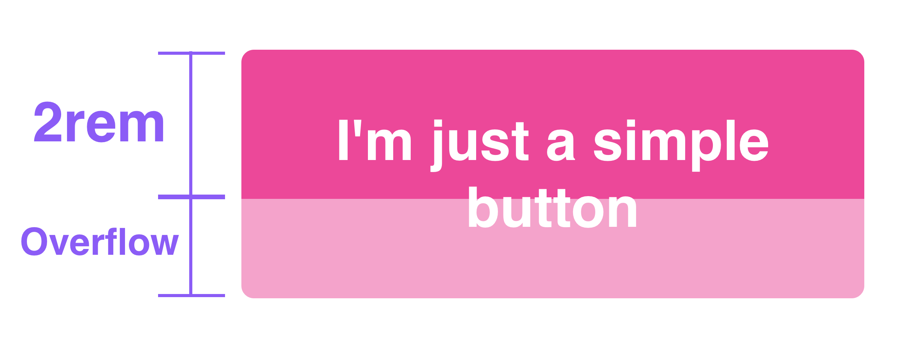
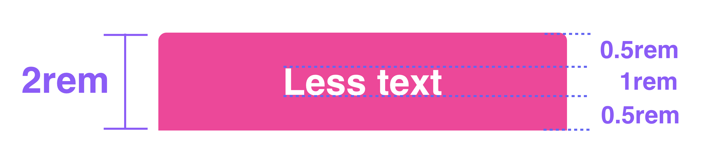
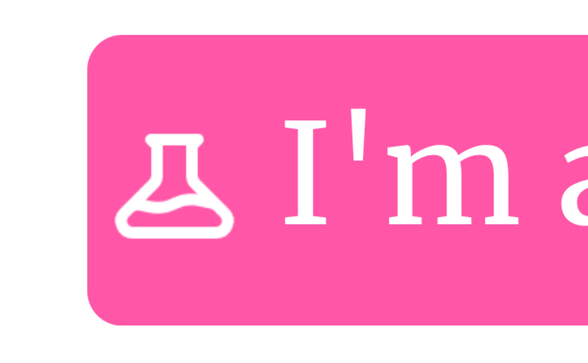

import Button from './Button'
import Experiment from './Experiment'
import FinalButton from './FinalButton'

Make _really_ responsive buttons is harder than one might think. In this post
we'll walk through the different issues that we, as developers, face when adding buttons to our websites.

## TLDR
Here's the final version so you can copy-paste it:

```css
.button {
  padding: 1rem 2%;
  text-align: center;

  @media (max-width: 768px) {
    padding-left: 1.5rem;
    padding-right: 1.5rem;
  }
}
```

Here's how it looks:

<FinalButton />

## Our Example
Let's start with a simple button with a bit of style (omitted for simplicity):

```html
<button>I'm just a simple button</button>
```

<Button className='' />

## Sizing
Let's add a bit of padding and set its height so it's `2rem` tall:

```html
button {
  height: 2rem;
  padding-left: 1rem;
  padding-right: 1rem;
}

<button>I'm just a simple button</button>
```

<Button className='h-8 px-4' />

It looks better now. Let's try putting more than one button:

<div style={{ display: 'flex' }}>
  <Button className='h-8 px-4' />
  <Button className='h-8 px-4'>Hey, I'm another cool button</Button>
  <Button className='h-8 px-4'>Look here, I'm cool too!</Button>
</div>

As you can see, since we set the button's height is set to `2rem`, they can't span
multiple lines. We can fix this by setting our button's height dynamically.

The problem we're trying to solve is: given a fixed width for our button; Our
solution is: span multiple lines. To simplify our problem, let's just have a
single button with a fixed width:

```html
button {
  // ...previous styles
  width: 10rem;
}

<button>I'm just a simple button</button>
```

<Button className='h-8 px-4' style={{ width: '10rem' }}>I'm just a simple button</Button>

What's going on is this:



To find a solution to our current issue, we need to find a padding such as the
finnal button's height is `2rem`:


Now that we know our problem, we can do the math:



Cool! So we need to use a vertical padding of `0.5rem`:

```html
button {
  // ...previous styles
  padding-top: 0.5rem;
  padding-bottom: 0.5rem;
  width: 10rem;
}

<button>I'm just a simple button</button>
```

Here's how it looks:

<Button className='px-4' style={{ padding: '0.5rem 1rem ', width: '10rem' }}>Less text</Button>

<br />
<br />

Let's test it out with a longer text:

<Button className='px-4' style={{ padding: '0.5rem 1rem ', width: '10rem' }}>Look here, I'm cool too!</Button>

Cool, it worked!

## Padding

Let's test our button under different widths to simulate different viewports:

<div style={{ display: 'flex' }}>
  <Button className='px-4 mr-2' style={{ padding: '0.5rem 1rem ', width: '5rem' }}>Look here, I'm cool too!</Button>
  <Button className='px-4 mr-2' style={{ padding: '0.5rem 1rem ', width: '10rem' }}>Look here, I'm cool too!</Button>
  <Button className='px-4' style={{ padding: '0.5rem 1rem ', width: '20rem' }}>Look here, I'm cool too!</Button>
</div>

Even though our button looks good and adjust its height automatically to its
content, it doesn't look good when it's too narrow:


<Button className='px-4 mr-2' style={{ padding: '0.5rem 1rem ', width: '5rem' }}>Look here, I'm cool too!</Button>

This is a common issue: padding looks good when there's plenty of space but it
doesn't look good when there's not enough of it. To solve this, we could start
by using a percentage padding:


```html
button {
  // ...previous styles
  padding-left: 2%;
  padding-right: 2%;
}

<button>I'm just a simple button</button>
```

As the MDN website specifies, when you use a percentage as a padding, it it "relative to the width of the containing block". This means that the padding, when using a percentage unit, it will be equivalent to the percentage of the width of the button's.

In the example below, when the button's parent is 250px and 500px wide, then a padding of `2%` will be equivalent to 5px and 10px respectively:

<div className='bg-blue-500 px-4 py-2 flex' style={{ width: '250px' }}>
<p>250px wide</p><Button style={{ paddingTop: '0.5rem', paddingBottom: '0.5rem', paddingLeft: '2%', paddingRight: '2%', width: '5rem' }}>Look here, I'm cool too!</Button>
</div>

<br />

<div className='bg-blue-500 px-4 py-2 flex' style={{ width: '500px' }}>
<p>500px wide</p><Button style={{ paddingTop: '0.5rem', paddingBottom: '0.5rem', paddingLeft: '2%', paddingRight: '2%', width: '5rem' }}>Look here, I'm cool too!</Button>
</div>

In our case, a padding of `1%` looks good:

<div style={{ width: '500px'}}>
<Button className='px-4 mr-2' style={{ padding: '0.5rem 1%', width: '5rem' }}>Look here, I'm cool too!</Button>
</div>

Now our button doesn't loose too many empty space on small screens. If you think
that the percentage padding that you choose on mobile doesn't look good on
bigger screens, you can always setup a media query with different paddings:

```html
button {
  // ...previous styles
  padding: 1rem 2%;

  @media (max-width: 768px) {
    padding: 1rem 1.5rem;
  }
}

<button>I'm just a simple button</button>
```

## Icons
Adding icons to your buttons is a bit tricky too. Let's add a simple svg icon
from [heroicons](https://heroicons.com/)

<Button className='px-4 mr-2' style={{ padding: '0.5rem 1%' }}><Experiment /> I'm an Experiment!</Button>

If you can't notice it, here's a zoomed version of the previous button:


It's not the big deal but more often than not you'll need to make small
adjustments to your icons, so let's continue!

A first solution to this is to use flexbox:

```html
button {
  // ...previous styles
  display: flex;
  align-items: center;
}
```

<Button className='px-4 mr-2' style={{ paddingTop: '0.5rem', paddingBottom: '0.5rem' }}><Experiment /> I'm an Experiment!</Button>

It kind of help but has two downsides:

* It's not completely exactly
* It doesn't work [**on Safari**](https://stackoverflow.com/questions/44301065/button-with-display-flex-does-not-work-in-safari-causing-size-and-alignment-is) so we need to find an alternative.

After a perfonal (long) quest on how to reliably align icons with text, I've
found that the easiest and reliable way to align icons is the following:

```css
.icon {
  position: relative;
  top: ?;
  left: ?;
}
```

That's is. You don't need to modify the parent's positioning to make this work.
Just apply this style. Let's test it with out button:

```css
.icon {
  position: relative;
  top: -1px;
  left: 0; // We can omit this since it's 0.
}
```

Here's the result:

<Button className='px-4 mr-2' style={{ paddingTop: '0.5rem', paddingBottom: '0.5rem' }}><Experiment style={{ position: 'relative', top: -1, left: 0 }}/> I'm an Experiment!</Button>

## How to Test Responsive Buttons
Test the responsiveness of your buttons is a manual step. There's no more
reliable way to know that your buttons look good under different sizes than your
eyes and the good old window resizing (or the mobile simulator included in browsers nowadays). Remember, responsive design is tricky and manual test is required to ensure a good experience for your users.

However, most of the time is a one-time test. You make something work well and
then apply that solution everywhere. In this case, you can just create a
`.button` class or a custom component, apply this solution, and apply it
everywhere. On other cases, you'll have several buttons, or less available space
and you need to tweak things on, so it's good that you know that tricks
presented in this article.

## Conclusion
In this article we saw how to make buttons to be *really* responsive: how to
make them look good when there's plenty and a lack of space, how to make it play
well with icons, and all the small details that differentiate a nice button from
a good one.

If you liked this article, you can [follow me on Twitter](https://twitter.com/giovannibenussi) and get my latest updates and random-posts on Twitter.

