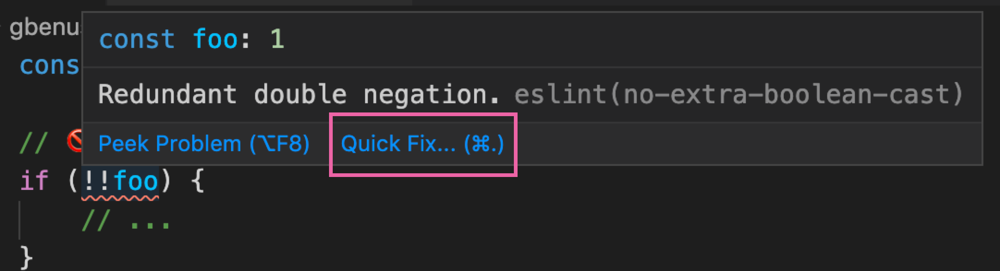

import Chat from '../Chat'

Linters are a great tool to find and fix problems in your code. It's like having a friendly coworker that reviews your code after every change
when it's most fresh. You can of course ignore it though and it's not gonna be
a weird situation as it would be in real life.

Let's see how they work in real world code:

```html
<a href="https://example.com" target="_blank">Link</a>
```

Here's the associated output on [ESLint](https://eslint.org/) when we write this
code:

> Using target="_blank" without rel="noreferrer" is a security risk: see https://html.spec.whatwg.org/multipage/links.html#link-type-noopener  react/jsx-no-target-blank

Let's see this in plain ol' english:

<Chat
  messages={{
'Today': [
    { message:  'Hey', side: 'right', time:'12:00' },
    { name: 'Linter', message: "Hey, what's up?", side: 'left', time: '12:00'},
    { message: "Could you give me some feedback for this code?", side: 'right', time: '12:00' },
    { message: "src/components/MyComponent.js", side: 'right', time: '12:00' },
    { name:'Linter', message: "Sure, just give me a milisecond...", side: 'left', time:'12:00' },
    { name:'Linter', message: "I noticed you're using target='_blank' without rel='noreferrer' on line 20", side: 'left', time:'12:00' },
    { name:'Linter', message: "That's not secure, look:", side: 'left', time:'12:00' },
    { name:'Linter', message: "https://html.spec.whatwg.org/multipage/links.html#link-type-noopener", side: 'left', time:'12:00' },
    { message: "Wow, I didn't knew that 😰", side: 'right', time:'12:00' },
    { message: "Thanks a lot for your help!", side: 'right', time:'12:00' },
  ]}
}
 />

All of this process took less than a second and you avoided a security risk for
your app and learned something new.

Another good example is when using the [ESLint](https://eslint.org/) plugin [eslint-plugin-jsx-a11y](https://github.com/jsx-eslint/eslint-plugin-jsx-a11y) for images like this:

```html

```

Here's the linter output for it:

> img elements must have an alt prop, either with meaningful text, or an empty string for decorative images  jsx-a11y/alt-text

Warnings like this are useful even if you know why you need to add an `alt` attribute to images. Sometimes you're in a rush or you can simply forgot about it and this warning saves your back. However, if you don't know why you need to add this `alt` attribute to your images, you can simply google the rule name (jsx-a11y/alt-text, it's at the end of the error message) and find this:

> Enforce that all elements that require alternative text have meaningful information to relay back to the end user. This is a critical component of accessibility for screen reader users in order for them to understand the content's purpose on the page. By default, this rule checks for alternative text on the following elements: ``, `<area>`, `<input type="image">`, and `<object>`.

## Linter Categories
There are a lot of categories for linters to help but don't worry, most of the
time you use a single tool (let's say [ESLint](https://eslint.org/) and just add
plugins to it). Here's a list of some categories for linters so you can get a
quick idea of them:

- Code Quality
- Frameworks
- Languages
- Libraries
- Best Practices
- Performance
- Security
- Style

This is pretty powerful. You have the option to learn the best practices from the best people in the community over a different variety of subjects. You don't need to be an expert in, let's say, performance, and you'll still get automatic suggestions about your code directly in your editor.

You can check a more comprehensive list of plugins for [ESLint](https://eslint.org/) on the [awesome-eslint](https://github.com/dustinspecker/awesome-eslint) repository.


## Common Concerns with Linters
### Linter Rules are Configurable
If you're worried about getting warnings about rules that you don't care / don't plan to solve now, you can disable them:

- Disable the rule in the whole project.
- Disable the rule on a given file.
- Disable the rule on a single line.

### Autofix
Usually linters provide secure automatic fixes for some of their rules. Most of the time this *is a secure process*. It will only run only on
a subset of rules and will unlikely impact how your code behaves.

What's the benefit of autofix your code? You can expend time fixing real issues. Let's take a look at some code so you can get an idea of what I'm talking about:

```js
// 🚫 no-extra-boolean-cast: Redundant double negation.
if (!!foo) {
    // ...
}


// 🚫 no-extra-boolean-cast: Redundant Boolean call.
if (Boolean(foo)) {
    // ...
}

// ✅
if (foo) {
    // ...
}
```

After running an autofix on it, it will look like this:

```js
// ✅
if (foo) {
    // ...
}


// ✅
if (foo) {
    // ...
}

// ✅
if (foo) {
    // ...
}
```

Cool, we got a warning and we fix it without effort on our side.

Most of the time this is an automatic command provided by your IDE or can be
triggered manually with a shortcut. For example, this is how it looks on [Visual Studio Code](https://marketplace.visualstudio.com/items?itemName=dbaeumer.vscode-eslint):



And this is how it looks on real life:


<Chat
  messages={{
    Today: [
      { message: "Hey, could you fix this for me?", side: "right", time: "12:00" },
      { message: "if (Boolean(foo)) { // ... }", side: "right", time: "12:00" },
      { name: "Linter", message: "Seriously?", side: "left", time: "12:00" },
      { message: "😬", side: "right", time: "12:00" },
      { name: "Linter", message: "Ok, here's it:", side: "left", time: "12:00" },
      { name: "Linter", message: "if (foo) { // ... }", side: "left", time: "12:00" },
      { name: "Linter", message: "I already added it to your file so you don't need to worry about it", side: "left", time: "12:00" },
      { message: "Awesome!", side: "right", time: "12:00" },
      { message: "Thanks a lot!", side: "right", time: "12:00" },
    ],
  }}
/>

That sounded a bit weird. Thankfully tools do this gladly.

Does it matter to save a few seconds of manual work? I think it does. You have
better things to care about that perform a change that you already know what
will be the end result. It's just adding/moving/removing some pieces of code, so
why don't let your computer take care of that?

## Conclusion
As we saw, linters are great tools to both avoid errors and educate people at
the same time. You can learn from the collective knowledge of a community (and
even collaborate yourself!) and avoid errors as soon as you type your code.

As a personal practice, I always try to setup a linter when I'm learning
something new. It speeds up my learning because I learn the best practices and
avoid common errors as soon as I type them. Pretty convenient!

---

If you have any question or ideas, I'd be glad to talk with you! You can [find me on Twitter](https://twitter.com/giovannibenussi) or send me an email at
[giovanni.benussi@usach.cl](mailto:giovanni.benussi@usach.cl) whenever you wan't
🙂
